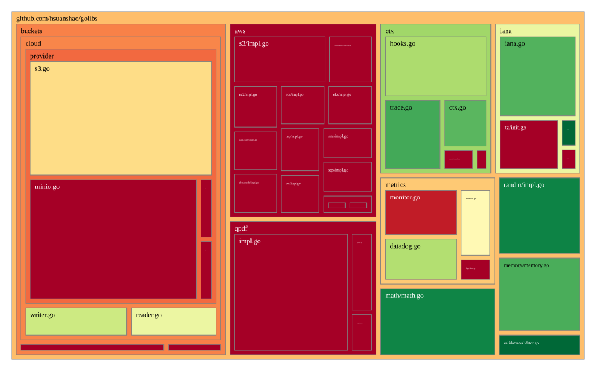

# golibs

golibs is a collection tools for GoLang project usage, any tool should be decoupling to any project internal requirements

[aws] provide a testable packages to integrate aws service(s), currently based on aws-sdk-go-v1

[buckets] handle Object Storage Service READ/Write service, could support integrate multiple platform (currently integrate AWS s3)

[ctx]:
based on GoLang context to extend its capability not only have context bypass, but also could handle log, and dump context info, provide detail trace back, and for each log, it also points out issue logged at when, in line no, of function name, and file name with folder name.
We also could integrate 3rd party logger forward service, initiative forward logs to agency service. (if we needed)

[math]: simple math tool

[memory]: memory tool, which could applied to measurement/monitor specific verb,obj memory usage

[metrics]: generic metrics libs tool

[qpdf]: PDF generate tool, easy to generate format report document, generated tiny PDF file size

[randm]: rand disc tool, help to generate RID, and rand n length string

validator:

## Project Status

